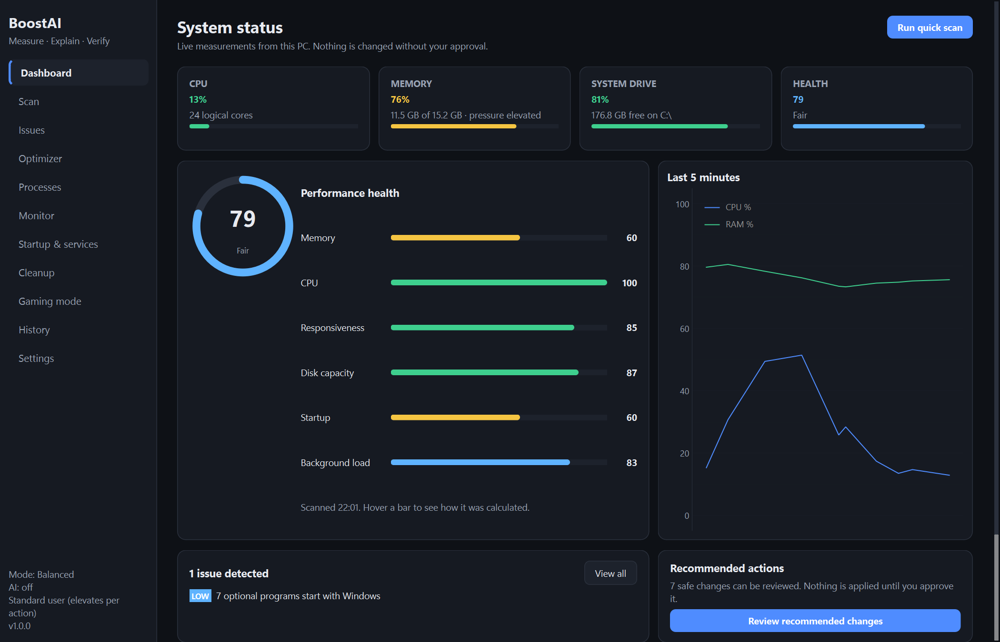
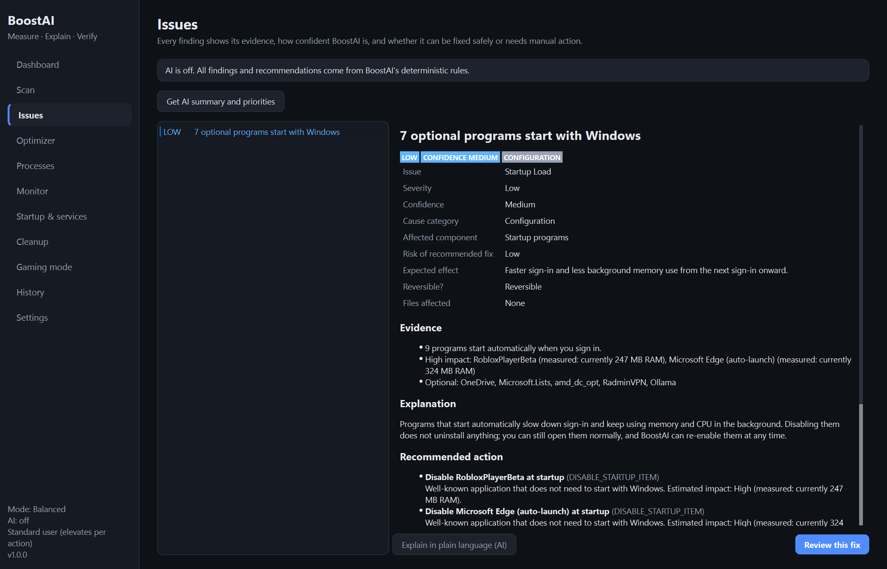
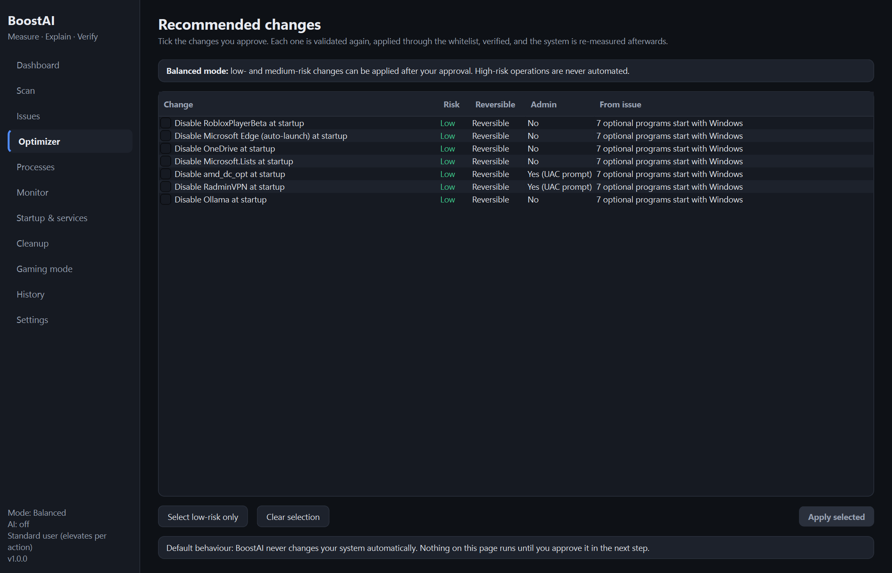
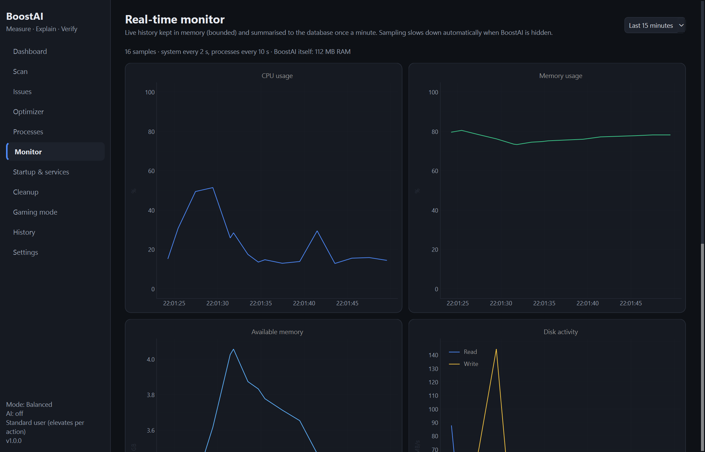
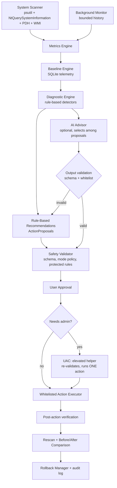

# BoostAI

**A safe, measurement-driven performance diagnostic and optimization tool for Windows.**

BoostAI scans a Windows PC, finds real, measurable performance problems (memory leaks,
RAM pressure, runaway CPU, startup bloat, disk pressure and more), explains them with the
evidence it collected, and applies fixes only when you approve them. Every fix is verified
by measuring again, and settings changes can be undone.

```
Scan -> Diagnose -> Verify -> Explain -> Your approval -> Fix -> Rescan -> Compare -> Roll back if needed
```

It is **not** a "RAM cleaner" and it never pretends every problem has a software fix: each
finding is classified as a software issue, possible memory leak, heavy workload, insufficient
RAM, hardware limitation, overheating, failing storage, possible driver issue, unusual
behaviour (never a malware verdict) or unknown cause.

> Python 3.11+ · PySide6 · SQLite · psutil + native Win32 APIs · optional local/cloud AI · MIT licence

---

## Screenshots

| Dashboard | Issue evidence |
|---|---|
|  |  |
| **Approval checklist** | **Real-time monitor** |
|  |  |

*Generate these on your own PC with `python scripts/capture_screenshots.py` (writes to
`docs/screenshots/`). Check them before publishing, because they show your process names.*

## Key features

- **Live dashboard**: CPU, RAM, system drive and a transparent health score with a per-category breakdown.
- **Memory-leak detection**: trend analysis of each process's *private (committed) memory*, not
  just "high usage", reported with LOW / MEDIUM / HIGH confidence and the evidence behind it.
- **RAM-pressure analysis**: separates "a leak" from "many programs open" from "not enough RAM",
  and lists the main contributors.
- **CPU analysis**: sustained load, background processes pinning a core, high idle CPU, repeated
  spikes, and interrupt/DPC time (a driver symptom). Games are recognised, so gaming load isn't
  flagged as a problem.
- **Disk**: free space, disk saturation and latency, and storage health reported by Windows
  (failing drive, HDD system drive).
- **Startup analysis**: every Run-key and Startup-folder entry categorised as Protected,
  Recommended keep, Optional, High impact or Unknown, using the same reversible switch as Task Manager.
- **Services**: every service is classified; only an explicit allow-list of optional services can be stopped or restarted.
- **Per-PC baselines**: "Discord normally uses 400–700 MB here; now 2.8 GB" instead of "Discord is bad".
- **Safe cleanup**: a fixed catalog of temp and cache locations, a dry-run first, and never cookies, history or passwords.
- **Before/after comparison**: identical measurement windows, with noise thresholds so noise isn't reported as improvement.
- **Per-action verification**: every change is re-measured, and results are *Successful*, *No
  meaningful improvement*, *Partial* or *Failed*, never assumed.
- **Rollback**: startup, power-plan and service changes are stored with their previous state and can be undone.
- **Modes**: Safe, Balanced, Gaming (pre-game check plus a reversible session) and Deep Scan.
- **Optional AI advisor**: local Ollama, Gemini or Groq for plain-language explanations and
  prioritisation. It is never required and never in control of the machine.
- **System tray**: low-overhead background monitoring and notifications for serious problems.

## Architecture



```
boostai/
├── main.py                 entry point (GUI, --scan console mode, --elevated-helper)
├── config/                 settings (pydantic), paths, structured redacting logging
├── core/                   engine (composition root), scanner, monitor, history, baselines,
│                           diagnostics, performance score, comparison, gaming mode, models
├── metrics/                cpu, memory, disk, processes, startup, services, temperatures, power, PDH
├── detection/              memory leak/build-up, memory pressure, cpu, disk, startup, services,
│                           anomaly (baseline), thermal/power detectors
├── actions/                action models, registry (whitelist), validator, executor, rollback,
│                           elevation broker + helper, cleanup catalog, system_ops, handlers/
├── security/               protected processes, protected/optional services, filesystem rules
├── knowledge/              startup-program catalog
├── ai/                     provider abstraction, Ollama/Gemini/Groq, advisor, schemas, credentials
├── database/               SQLite schema + repository
├── ui/                     PySide6 main window, pages/, dialogs, theme, workers
└── utils/                  ctypes Win32 wrappers, native process snapshot, WMI helper
tests/                      pytest suite (fake SystemOps: no real system changes)
packaging/, scripts/        PyInstaller spec, Inno Setup script, build and screenshot scripts
docs/                       scoring documentation, screenshots
```

The UI package lives inside `boostai/` (rather than a top-level `ui/`) so the app is a single
importable package for packaging and tests. The core is Qt-free and usable from scripts.

## Safety model

Safety is enforced by code, not by prompts:

1. **Whitelist only.** 13 actions exist: `RESTART_PROCESS`, `CLOSE_USER_PROCESS`,
   `TRIM_PROCESS_WORKING_SET`, `DISABLE_STARTUP_ITEM`, `ENABLE_STARTUP_ITEM`,
   `CLEAR_SAFE_TEMP_FILES`, `CLEAR_SPECIFIC_SAFE_CACHE`, `CHANGE_POWER_PLAN`, `FLUSH_DNS`,
   `STOP_OPTIONAL_SERVICE`, `RESTORE_OPTIONAL_SERVICE`, `RESTART_SERVICE`, `CREATE_RESTORE_POINT`.
   An unknown ID is **rejected**. Each action declares its risk, reversibility, requirements,
   affected component, validation checks, execution method, verification and rollback method.
2. **No command strings anywhere.** OS changes go through one module
   (`actions/system_ops.py`) of fixed, typed operations (documented Win32 APIs, registry
   values, Service Control Manager). There is no `os.system`, no `shell=True`, no PowerShell,
   no `eval`/`exec`, and a test enforces this. Restarting an app relaunches only its own
   verified executable.
3. **Strict parameter schemas** (pydantic, extra fields forbidden, patterns for service names and GUIDs).
4. **Deterministic protection rules** that AI never influences. A process can only be touched if it belongs
   to the current user, is not in session 0, does not host a service, is not under
   `%SystemRoot%`, is not a critical Windows or security/anti-cheat process, is not BoostAI
   itself, and its identity (PID and creation time) still matches. Anything uncertain is **"Action blocked for safety."**
5. **Services** use an allow-list; everything else is protected (security, RPC, networking,
   update, audio, storage, auth…) or "Manual review required." Start types are never changed.
6. **Cleanup** uses a fixed catalog of locations. There's no link or junction following, personal folders
   are forbidden, files must be older than the age limit (by both modified *and* creation time),
   locked files are skipped, and browser cleaning covers cache only.
7. **Explicit approval.** The executor refuses requests without an approval token that the approval dialog
   creates after your click. Closing or restarting apps requires confirming you saved your work; forcing an
   unresponsive app needs its own opt-in.
8. **Mode policy.** Safe mode executes LOW risk only, Balanced mode LOW and MEDIUM. HIGH risk is never automated.
9. **Elevation per action.** The app runs as a standard user. An admin-only action is written as
   *structured data* to the per-user data folder and executed by a short-lived UAC-elevated
   BoostAI helper that re-runs the full validation, refuses actions that don't need admin, runs
   that one action, and exits.

Never done: deleting personal files, uninstalling programs, deleting registry keys, touching Defender,
Windows Update or the firewall, killing critical processes, modifying boot configuration, drivers,
BIOS, voltages or clocks, or running AI-generated commands.

## Technology stack

| Concern | Choice |
|---|---|
| Language | Python 3.11+ (developed on 3.14) |
| GUI | PySide6 (Qt 6) + PyQtGraph charts |
| Metrics | psutil, `NtQuerySystemInformation` process snapshot (ctypes), PDH counters (pywin32), WMI Storage provider, NVML |
| Storage | SQLite (WAL) via a small repository layer |
| Models / validation | pydantic v2 |
| AI (optional) | Ollama (local), Google Gemini, Groq (stdlib HTTP, no SDKs) |
| Tests | pytest, pytest-qt |
| Packaging | PyInstaller (one-folder) + Inno Setup (per-user installer) |

## Setup

Requirements: Windows 10 or 11 (64-bit) and Python 3.11 or newer.

```powershell
git clone <your-repo-url> BoostAI
cd BoostAI
python -m venv .venv
.\.venv\Scripts\Activate.ps1
pip install -r requirements-dev.txt
pip install -e .
```

### Running

```powershell
python run.py              # desktop app (same as: python -m boostai)
python run.py --minimized  # start in the system tray
python run.py --scan       # read-only console scan, prints findings, changes nothing
```

### Running tests

```powershell
python -m pytest            # full suite; dangerous operations are faked
python -m pytest -m "not integration"   # skip tests that read real system state
```

The suite injects a fake `SystemOps`, and an autouse fixture makes any attempt to spawn a
process or shell fail the test.

### Building the .exe and installer

```powershell
.\scripts\build.ps1
```

This produces `dist\BoostAI\BoostAI.exe`. If [Inno Setup 6](https://jrsoftware.org/isinfo.php)
is installed, it also builds `installer_output\BoostAI-Setup-1.0.0.exe`, a per-user installer
that doesn't need admin.

## AI setup (optional)

BoostAI works fully with AI **off** (the default). AI only adds explanations and prioritisation.

**Local (recommended, free, private):** install [Ollama](https://ollama.com), then

```powershell
ollama pull qwen2.5:7b          # or llama3.2:3b on machines with less memory
```

Then choose *Settings → AI → Local – Ollama* and press *Test AI connection*. The model is
only loaded when you press an AI button and is unloaded shortly afterwards.

**Cloud (optional, free tiers):** get a key from Google AI Studio (Gemini) or GroqCloud,
enter it in *Settings*, where it is stored in **Windows Credential Manager** (or set
`GEMINI_API_KEY` / `GROQ_API_KEY` in `.env`, see `.env.example`), and untick *Local-only
mode*. While cloud AI is enabled the app shows:
*"Cloud AI enabled. System performance metadata may be sent to the configured AI provider."*
Requests are made only when you click an AI button, so free-tier quotas go a long way; if a
quota is exhausted, BoostAI falls back to its rule-based advice.

**How AI output is contained:** the model receives the detected issues and, for each, the
list of candidate actions the rule engine already proposed. It must answer in a strict
JSON schema and can only *select* one of those candidates. Unknown action IDs are
**REJECTED**, and actions that weren't proposed for that issue, out-of-range indexes, overlong
text and malformed JSON are discarded. On any failure the deterministic recommendation is
used. Selected actions still go through validation and your approval.

## Windows permissions

| Operation | Needs admin? |
|---|---|
| Scans, monitoring, history | No |
| Close/restart/trim your own apps | No |
| Startup items (current user) | No |
| Startup items (all users, HKLM) | Yes (UAC per action) |
| Power plan, DNS flush | No |
| Your TEMP, crash dumps, caches | No |
| Windows TEMP | Yes |
| Optional services, restore point | Yes |

## Database

`%LOCALAPPDATA%\BoostAI\boostai.db` (override with `BOOSTAI_DATA_DIR`), with these tables:

- **`scans`**: timestamp, CPU, memory, available memory, commit, pressure, disk usage, process
  count, health score (+ breakdown), issue count
- **`system_samples`**: per-minute averages; compacted to 5-minute buckets after 24 h and
  expired after 30 days
- **`process_samples`**: the top-25 memory users per minute; expire after 7 days
- **`issues`**: type, severity, confidence, evidence, status, full payload
- **`actions`**: the audit log (action, target, params, previous/new state, result,
  verification, reversibility, rollback status, session)
- **`baselines`**: per-process and system medians, 95th percentiles and means
- **`comparisons`**: before/after measurements

Maintenance runs hourly, so the database stays small.

## How detection works

**Memory leaks.** For each process instance (keyed by PID *and* creation time), BoostAI tracks
private bytes (commit charge). A possible leak requires **all** of the following:
- at least 10 minutes of observation
- growth of at least 200 MB and at least 30%
- a positive least-squares slope with R² ≥ 0.5
- at least 60% of steps non-decreasing
- memory released during the window of no more than 35% of the growth

Confidence comes from a score over:
- how steady the growth is (R²)
- how persistent it is (share of non-decreasing steps)
- how little memory is released
- how long it has been observed
- the absolute size of the growth
- whether usage is well above this PC's baseline for the app

The report includes the growth rate and, if relevant, how soon the available RAM would run
out. The wording is always "possible", because more tabs or documents also grow memory.
Multi-process apps (browsers) also get an app-level *build-up* check, with confidence capped at MEDIUM.

**RAM pressure.** The pressure level uses available RAM %, commit % and hard-fault rate. The
explanation distinguishes a leak, a single dominant app, many programs open, and persistently
insufficient RAM (on machines with 8 GB or less).

**CPU.** Everything is judged over a window (default 3 minutes). Load from the foreground
full-screen app or a recognised game is reported as expected (INFO). A background process
averaging about one full core is flagged, as is high CPU while the user is idle (compared with
this PC's idle baseline), and interrupt/DPC time of 10% or more is reported as a probable driver issue.

**Scoring.** See [docs/SCORING.md](docs/SCORING.md).

## Optimization actions and verification

| Action | Risk | Reversible | Verification |
|---|---|---|---|
| Restart application | Medium | n/a | Private memory before vs 10 s after relaunch |
| Close application | Medium | No | Process gone; memory released; available RAM change |
| Trim working set | Low | n/a | Working set before/after (reports private memory unchanged) |
| Disable / enable startup item | Low | **Yes** | Re-reads the StartupApproved flag |
| Remove safe temp files / clear a cache | Low | No | Bytes deleted + measured free-space change |
| Switch power plan | Low | **Yes** | Re-reads the active scheme |
| Flush DNS | Low | n/a | API result (no performance claim) |
| Stop / start / restart optional service | Medium/Low | **Yes** / n/a | Service state (+ host memory) |
| Create restore point | Low | n/a | New restore point sequence number exists |

If there is no measurable effect the result is *"No meaningful improvement detected"*.
After applying changes, BoostAI waits a settling period, re-measures with the same window
and shows only differences larger than noise (≥ max(100 MB, 1% of RAM), ≥ 3 CPU points,
≥ 3 processes, or a pressure-level change).

## Rollback

Every executed action is stored with its previous state. Startup items restore the *exact*
previous `StartupApproved` bytes (or remove the marker if none existed). Power plans restore
the previous scheme, and stopped services are started again. *History → Undo change*
performs the rollback (elevating if the original action needed it). Gaming Mode tags its
changes with a session ID so *End gaming mode* restores them in reverse order. Closed
applications and deleted temporary files are labelled NOT_REVERSIBLE.

## Privacy

- Everything runs and is stored locally. Local-only mode is **on by default**, so nothing leaves the PC.
- The app never uploads file names, file contents, browser data, emails or passwords.
- AI requests contain only metrics, issue types, severity, evidence text and process names.
  File paths and `DOMAIN\user` strings are scrubbed before sending.
- Logs are size-capped JSON lines (`%LOCALAPPDATA%\BoostAI\logs`), and API keys and tokens are redacted.

## Performance of BoostAI itself

The app uses one native process snapshot per sample (about 40 ms of CPU for ~350 processes)
instead of per-process queries. Expensive queries run only during scans, and GPU temperature is
never polled in the background (to avoid waking a sleeping laptop GPU). Sampling slows down when
the window is hidden, and database writes are batched to one row per minute. Measured on the
development laptop: **~0.14% total CPU and under 100 MB of RAM** in tray mode.

## Limitations

- Windows only; developed on Windows 11 24H2/25H2, and Windows 10 is supported on a best-effort basis.
- CPU temperature needs a hardware-monitor driver (e.g. LibreHardwareMonitor running); without
  one BoostAI says it's unavailable. GPU temperature is NVIDIA-only (NVML).
- Startup impact is an estimate (catalog knowledge or measured memory); Windows' own impact
  data isn't public. Scheduled-task and service-based autostarts aren't listed.
- Leak detection needs history: open the app for a while or run a Deep Scan.
- Detection can't see inside applications: it can't tell which browser tab leaks, and it isn't an antivirus.
- The elevated helper has been exercised through its code path and tests, but UAC prompts
  themselves can't be automated in the test suite.

## Roadmap

- Scheduled-task autostart inspection (read-only first)
- Per-GPU utilisation and VRAM pressure via NVML / D3DKMT
- Export of scan reports (HTML/PDF)
- Signed release builds and an update channel
- Localisation

## License

MIT, see [LICENSE](LICENSE).
